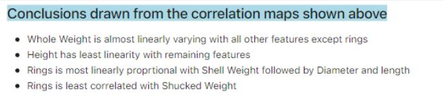
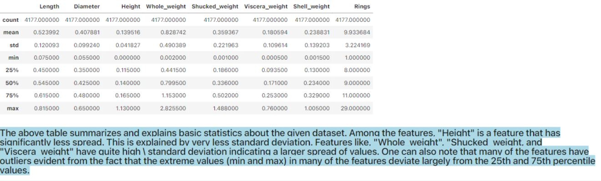

### Assessment of Data and Applying Normalization on Abalone Dataset and Wine Dataset.

We used Libraries such as Numpy, pandas, Seaborn, Matplotlib, Scipy and Scikit-learn.
1. Performed Analysis methods on the provided Dataset.
2. Drawn Conclusion from the Dataset.

Conclusion from Dataset

With the help of the data analysis we also summarised the data in order to check the presence of Outliers and Noise.

# Implementation:
1. Performed One-Hot Encoding technique to simpify the removal of Outliers present in the dataset.
2. Checked whether the data is unabalanced or balanced dataset.
3.  Observing the dataset and checking whether to perform Normalization techniques as normalization brings data to a common scale. Especially in KNN algorithm which relies on distance as a metric, it performs better when we normalize data to a generic scale. On top of that, majority of the features are of numeric type which benefits from the centering and standardization effect offered by normalization. Hence, it is essential to normalize the data.    
4. Performing KNN classification on the normalized Dataset. (for Both Min-Max and Z-Score Normalization techniques)

