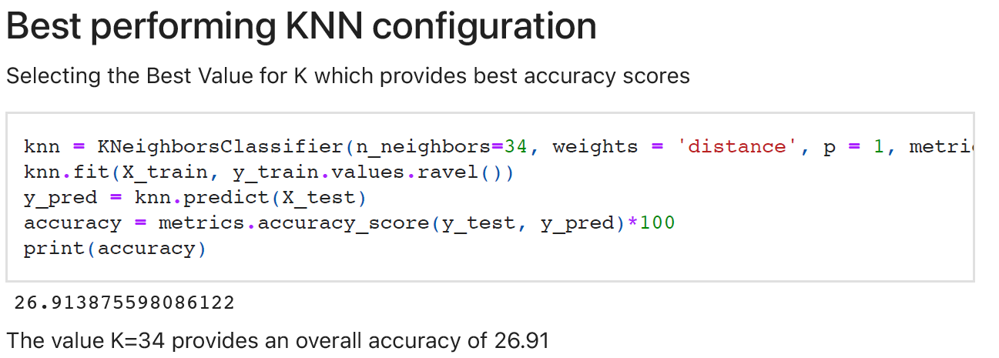
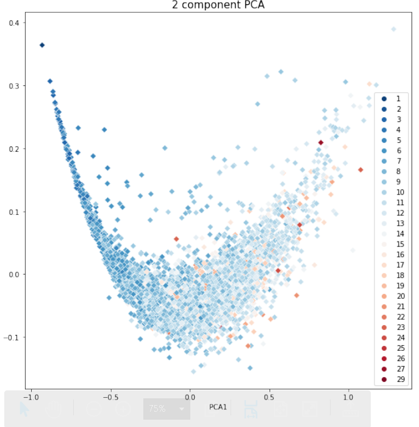
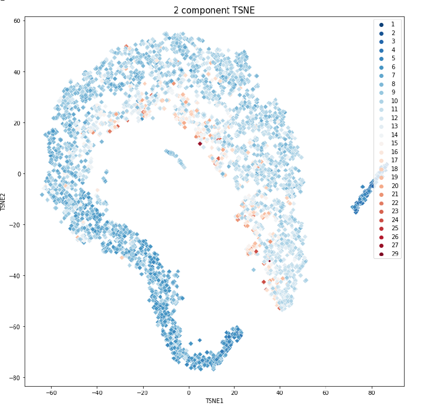
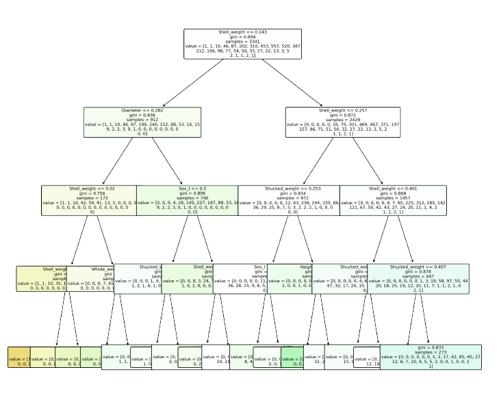
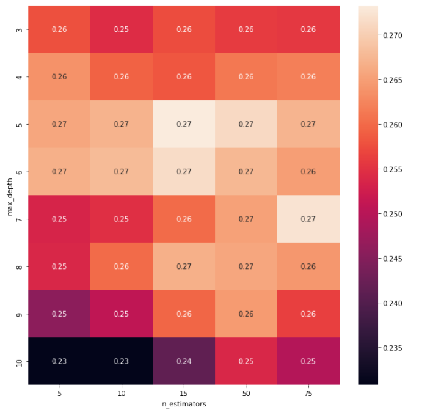
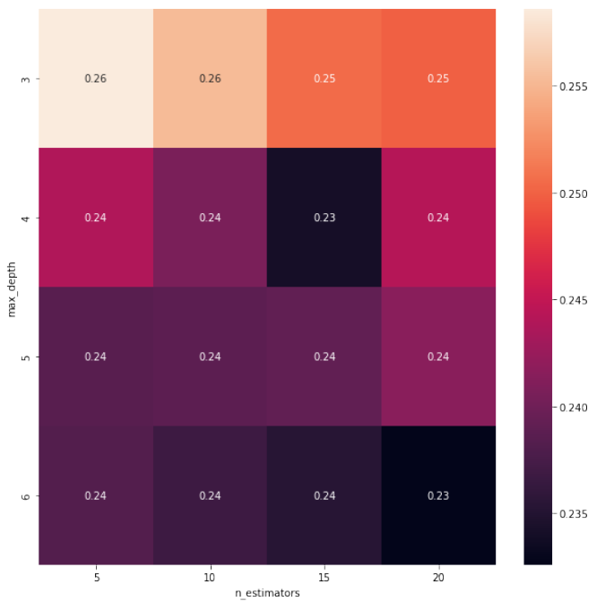

### Assessment of Data and Applying Normalization and various classification techniques on Abalone Dataset

We used Libraries such as Numpy, pandas, Seaborn, Matplotlib, Scipy and Scikit-learn.

## Overview and Implementation
1. Performed Analysis methods on the provided Dataset and used One-hot encoding on the dataset.
2. Drawn Conclusion from the Dataset.
3. Performed Normalization (Min-Max Normalization)
4. Improving KNN with Min-Max Normalization
5. Getting the best performing KNN  configuration.
6. Performing Principal component analysis (PCA) and (TSNE) and Linear discriminant analysis.
7. Getting KNN classification on PCA, TSNE and LDA analysis.
8. Using Naive Bayes (Multi-Nomial Naive Bayes and Complementary Naive Bayes) on Raw data, PCA data and LDA data.
9. DEcision tree and Random Forest classification on Raw data, PCA data and LDA data.
10. Gradient Boosting to improvise the gradient and obtaining the best CV score with it.
11. The same process from Step 1 to Step 10 is followed for Wine Dataset.

# Few Experimental Results

PCA- Principal Component Analysis

TSNE

Obtaining best KNN classification

Decision Tree Classifciation

Random Forest classification

Gradient Boosting 
