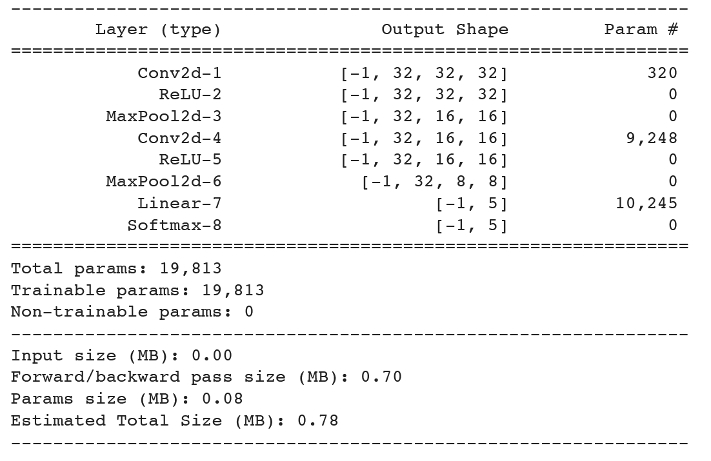
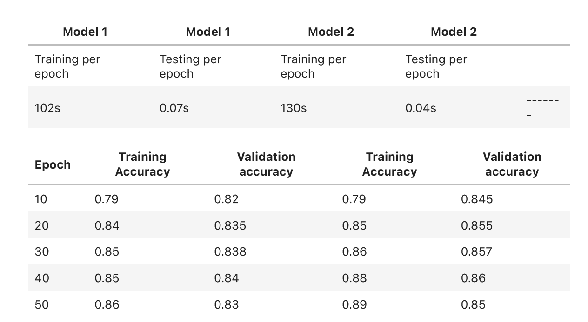
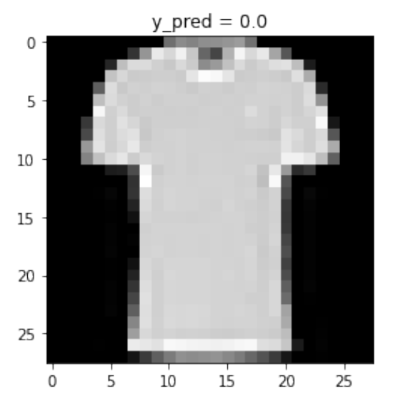

### Clustering and Classifcation with Deep Learning on the Fashion-MNIST with a Twist!

We used Libraries such as Torchvision, Pickle, Numpy, pandas, Seaborn, Matplotlib, Scipy and Scikit-learn.

## Overview and Implementation
1. Visualized the encoding with the first two components from PCA analysis.
2. Performed DBSCAN and K-means clustering algorithms on the features that have been ex- tracted from own designed model with 5 clusters and visualized the results. 
3. Used the resulting clusters as alternate colour mappings for the PCA plot.
4. Applied t-SNE on the features that have been extracted for own designed model an visualized the results in the same way.
5. Based on the results of clustering and t-SNE checked what are the labels for the given dataset? This helped to list out a random selection of data entries (the original images) for each cluster and their label value to help understand the patterns of each cluster might represent.

# Few Experimental Results
CNN Functions and Getting Loss vs Epoch data

Accuracy Observations\

Input Image reconstruction\
<<<<<<< HEAD

